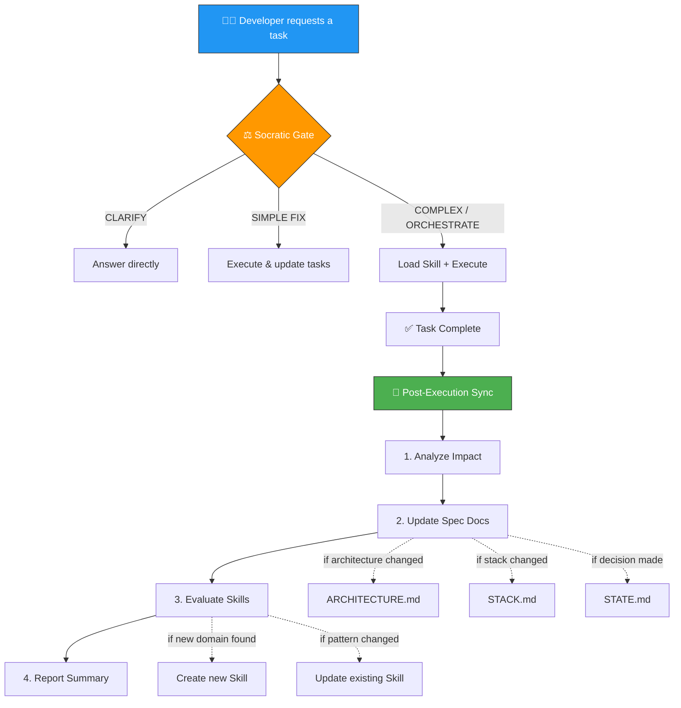

<div align="center">

# 🧠 Brain + Agent Architecture

**Give your AI real project memory. Build things that actually scale.**

[](./LICENSE)
[](https://github.com/henriquecaner/brain-agent/stargazers)
[](https://github.com/henriquecaner/brain-agent/issues)
[](https://github.com/henriquecaner/brain-agent/commits/main)
[](./CONTRIBUTING.md)
[](https://github.com/henriquecaner/brain-agent/actions/workflows/lint.yml)

<br/>

[Customization](./CUSTOMIZATION.md) · [Upgrade](./UPGRADE.md) · [Contributing](./CONTRIBUTING.md) · [Changelog](./CHANGELOG.md)

</div>

---

## Table of Contents

- [The Problem](#-the-problem-ai-amnesia)
- [The Solution](#-the-aha-solution-project-native-memory)
- [Install (1 Minute)](#-install-1-minute)
- [Initialize (Inside Antigravity)](#-initialize-inside-antigravity)
- [How It Works](#%EF%B8%8F-how-it-works-the-4-pillars)
- [Contributing](#-contributing)
- [License](#-license)

---

## 🤯 The Problem: AI Amnesia + Zero Standards

You're building with AI — whether you're a vibecoder shipping your first SaaS or a seasoned builder scaling a product. And you've hit **two walls**:

### 🧠 Wall 1: It Forgets Everything
- Every new chat, the AI **starts from scratch**
- It forgets your tech stack, your architecture, your patterns
- You keep copy-pasting the same instructions over and over

### 📏 Wall 2: It Has No Standards
- It hardcodes secrets, skips error handling, writes sloppy code
- It mixes patterns — half your app looks one way, half looks another
- There are **no guardrails** to enforce quality, security, or consistency

**Why?** Because the AI only sees isolated files. It has no "big picture" and no rules to follow. You end up repeating yourself every single time — and even then, nothing guarantees it will actually listen.

It's exhausting — and it doesn't scale.

---

## 💡 The "AHA!" Solution: Project-Native Memory

What if your repository had its own persistent, structured brain?

**Brain + Agent Architecture** is a framework that lives *inside* your Git repository. It gives your AI **persistent project memory** and **specialized agent skills** through the `.agents/` directory structure that tools like [Google Antigravity](https://blog.google/technology/google-labs/google-antigravity/) natively support.

Before the AI writes a single line of code, it automatically reads your project's specs to understand the scope, current tasks, and strict engineering rules.

```text
┌─────────────────────────────────────────────────────────────┐
│                    YOUR PROJECT ROOT                        │
│                                                             │
│  📁 .specs/                  ← Project State & Memory       │
│  │  📁 project/                                             │
│  │  │  STACK.md              ← Scope, goals, tech stack     │
│  │  │  ARCHITECTURE.md       ← Technical deep dive          │
│  │  │  STATE.md              ← Decisions, blockers, risks   │
│  │  │  CONVENTIONS.md        ← Coding rules & patterns      │
│  │  │  ROADMAP.md            ← Milestones & timeline        │
│  │  📁 features/                                            │
│  │  │  📁 [feature-name]/                                   │
│  │  │  │  spec.md            ← Feature specification        │
│  │  │  │  tasks.md           ← Atomic task breakdown        │
│                                                             │
│  📁 .agents/                 ← AI Agent Configuration       │
│  │  📁 rules/               ← Universal Laws (always on)    │
│  │  │  universal-agent-rules ← Orchestrator behavior        │
│  │  │  engineering-laws      ← Security & code standards    │
│  │  📁 skills/              ← Specialized AI Skills         │
│  │  │  📁 brain/            ← Planning & execution          │
│  │  │  📁 code-review/      ← On-demand Review skill        │
│  │  │  📁 debugging/        ← On-demand Debug skill         │
│  │  │  📁 testing/          ← On-demand Test skill          │
│  │  📁 workflows/           ← Automated Procedures          │
│  │  │  global-workflow      ← Dev setup & commands          │
│  │  │  post-execution-sync  ← Auto-sync specs after work    │
└─────────────────────────────────────────────────────────────┘
```

**The Result:**
- 📖 **Zero Context Loss:** The AI knows your exact tech stack and architectural decisions — every single chat.
- ⚖️ **Enforced Standards:** Agent rules are **always on** — they run on every interaction, guaranteeing the AI respects your specs, your security rules, and your architecture. No exceptions.
- 🥷 **Dynamic Skills:** When you ask for help with code review, debugging, or testing, it silently loads the right skill and applies specialized knowledge on demand.

> **Built for [Google Antigravity](https://blog.google/technology/google-labs/google-antigravity/)** — leveraging native support for `.agents/rules/`, `.agents/skills/`, and `.agents/workflows/`.

---

## 🚀 Install (1 Minute)

> **Already using v1.x?** You can automatically upgrade your project memory to v2.0.0 simply by asking the AI! Check out the [Upgrade Guide](./UPGRADE.md) for the Master Prompt.

The install adds **only two folders** to your project: `.specs/` and `.agents/`. Nothing else.

### Option 1: One-liner (Recommended)

Open your terminal **at your project root** and run:

```bash
curl -fsSL https://raw.githubusercontent.com/henriquecaner/brain-agent/main/install.sh | bash
```

### Option 2: Clone & Install

```bash
git clone https://github.com/henriquecaner/brain-agent.git /tmp/brain-agent
/tmp/brain-agent/install.sh
rm -rf /tmp/brain-agent
```

### What gets installed

```text
your-project/
├── .specs/                   ← 5 spec templates (empty, ready to fill)
│   └── project/
│       ├── STACK.md
│       ├── ARCHITECTURE.md
│       ├── STATE.md
│       ├── CONVENTIONS.md
│       └── ROADMAP.md
├── .agents/
│   ├── rules/                ← 2 always-on rule files
│   ├── skills/               ← 5 pre-built skills (brain, code-review, debugging, testing, template)
│   └── workflows/            ← 2 workflow files
└── (your existing files untouched)
```

> **That's it.** No config files, no `npm install`, no build step. Just markdown files that your AI reads automatically.
> 
> 🛡️ **Safe Merge Architecture:** If your project already has an `.agents/` folder (such as those natively created by Antigravity), the `install.sh` script employs a "no-clobber" safe merge. It will dynamically inject only the missing framework components and will **never** overwrite your existing custom rules or files.

---

## 🧠 Initialize (Inside Antigravity)

> [!CAUTION]
> **This step happens INSIDE Antigravity, NOT in the terminal.**
> Open your project in Antigravity and paste one of the prompts below **in the chat**.

### 🅰️ Path A — Your project already has code

Open Antigravity at your project root and paste this prompt:

> **"Map codebase — this is an existing project. Deeply analyze the codebase and fill all .specs/ documents with the real architecture, stack, and patterns."**

The AI will:
1. Scan your entire codebase
2. Auto-fill `.specs/project/STACK.md`, `ARCHITECTURE.md`, and all other spec docs
3. Configure skills and workflows for your specific stack

### 🅱️ Path B — You're starting from scratch

Open Antigravity at your project root and paste this prompt:

> **"Initialize project — this is a new project. Act as a Tech Lead: ask me strategic questions to define scope, tech stack, and goals before scaffolding anything."**

The AI will:
1. Ask you strategic questions about your goal
2. Draft the `.specs/project/STACK.md` and propose an `ARCHITECTURE.md`
3. Guide you through setting up the initial scaffolding

> [!IMPORTANT]
> **Don't skip initialization.** The spec templates are intentionally empty — the AI fills them with your real project data. Without this step, the AI has no context to work with.

---

## ⚙️ How It Works (The 4 Pillars)

### 1. 🧠 The Specs (`.specs/`)
**The concept:** AI assistants suffer from amnesia — they drop context over long chats. The `.specs/` directory acts as a permanent memory bank that the AI reads *before* acting.

The single source of truth for Project State. The AI reads this to know *what* we are building and *why*.
- `STACK.md` — The exact tech stack and end goals. (Prevents the AI from suggesting Python in a TS repository).
- `ARCHITECTURE.md` — The technical truth. The AI uses this to avoid breaking existing patterns.
- `STATE.md` — Decisions, blockers, risks, and lessons learned across sessions.
- `CONVENTIONS.md` — Coding rules and patterns specific to your project.
- `ROADMAP.md` — Milestones and timeline tracking.

### 2. ⚖️ The Laws (`.agents/rules/`) — Always On
These are the **guardrails**. Unlike skills (which are on-demand), rules are **always active** — Antigravity loads them on every single interaction. This is what guarantees the AI will always read the specs, follow your standards, and never go rogue.

- `engineering-laws.md` — Enforces security boundaries, async rules, clean architecture, and testing standards. The AI **cannot** skip these.
- `universal-agent-rules.md` — The "Orchestrator" that forces the AI to read the specs before acting, and routes it to the right skills based on what you're asking.

> **This is the key insight:** The specs hold the knowledge, but the Rules are what **enforce** it. Without always-on rules, the AI could simply ignore the specs. With them, it can't.

### 3. 🎯 Agent Skills (`.agents/skills/<skill>/`)
**The concept:** You can't put *every* rule in the main prompt, or the AI gets confused and slow. Skills solve this through **dynamic routing**.

Agent Skills are **specialized, hyper-focused knowledge loaded strictly on-demand**.
If you ask the AI to "fix the padding on the login button", it detects the "frontend" domain, silently reads `.agents/skills/frontend-design/SKILL.md` (where you define your Design System rules), and applies them perfectly.

Instead of one generic AI, you get a team of specialized experts (UI, Database, Security) that only activate when you need them.

### 4. 🔄 Workflows (`.agents/workflows/`) — Self-Healing Context
**The concept:** Without automation, spec docs and Skills go stale as the codebase evolves. Workflows keep the system **alive and accurate**.

The key workflow is **`post-execution-sync`** — triggered automatically after every complex task. It analyzes what changed, updates the relevant spec documents, and evaluates whether new Skills are needed.

- `global-workflow.md` — Dev environment setup and common commands.
- `post-execution-sync.md` — **The self-healing loop** that keeps specs & Skills in sync with reality.

> **Why this matters:** The specs are only useful if they're accurate. This workflow ensures they *stay* accurate — automatically, without manual effort.



---

## 📋 Day-to-Day Usage

### Automatic: Post-Execution Sync

For **complex tasks** (feature builds, refactors, architecture changes), the `post-execution-sync` workflow runs automatically. It updates spec docs and evaluates Skills without manual effort.

> You can also trigger it manually with `/post-execution-sync`.

### Manual Updates

For **simple fixes**, use this reference:

| When This Happens... | Update This File |
|----------------------|-----------------|
| Task started or finished | `.specs/features/[feature]/tasks.md` |
| Architecture decision made | `.specs/project/STATE.md` |
| Major refactor completed | `.specs/project/ARCHITECTURE.md` |
| Sprint completed | `.specs/project/ROADMAP.md` |
| New risk identified | `.specs/project/STATE.md` |
| Coding patterns changed | `.specs/project/CONVENTIONS.md` |

---

## 🤝 Contributing

Contributions are welcome! Whether you're a vibecoder, a builder, or a traditional developer — we'd love your input. Please read the [Contributing Guide](./CONTRIBUTING.md) and the [Code of Conduct](./CODE_OF_CONDUCT.md) before submitting a PR.

---

## 📚 Documentation

| Document | Description |
|----------|-------------|
| [Customization](./CUSTOMIZATION.md) | Create custom skills, rules, and workflows |
| [Upgrade Guide](./UPGRADE.md) | Upgrade to new versions without losing customizations |
| [Contributing](./CONTRIBUTING.md) | How to contribute to this project |
| [Changelog](./CHANGELOG.md) | Version history and release notes |

---

## 📄 License

This project is licensed under the [MIT License](./LICENSE).
